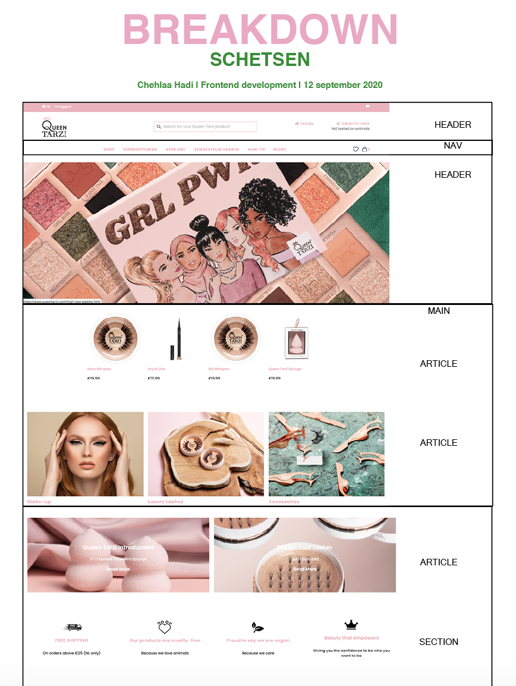
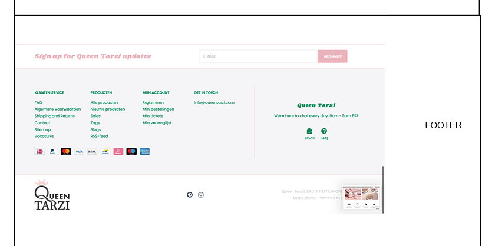

# Procesverslag
Chehlaa 

## Bronnenlijst
1. https://www.w3schools.com/jsref/tryit.asp?filename=tryjsref_style_backgroundcolor 
2. https://www.w3schools.com/html/tryit.asp?filename=tryhtml_youtubeiframe
3. http://www.simplehtmlguide.com/youtube.php 
4. https://www.w3schools.com/css/css_form.asp
5. http://jsfiddle.net/5Gy6K/ 
6. https://www.youtube.com/watch?v=68O6eOGAGqA&feature=youtu.be
7. https://www.w3schools.com/cssref/sel_nth-child.asp

## Eindgesprek (week 7/8)

In het begin vond ik het lastig om weer te coderen na een paar maanden, ik was bepaalde dingen vergeten maar gelukkig bestaat W3 schools. Dit heeft mij echt geholpen. Ook vond ik het moeilijk om een hamburgermenu te maken met javascript voor de mobiele versie. Ik heb javascript gebruikt voor een dark modus button die je aan kan zetten als je op die how to pagina een youtube filmpje kijkt. Ik persoonlijk vind het fijner als ik een filmpje kijk dat de rest van de pagina donker is. Dan gaat de volle focus naar het filmpje. 

**Screenshot(s):**

## Voortgang 3 (week 6)

Ik zag dat ik feedback had gekregen van Kris. Mijn code semantisch correcter maken door de divjes vervangen. Dit heb ik gedaan met articles en sections. 

## Voortgang 2 (week 5)

Ik ben begonnen met research te doen naar grids, ik heb een heel duidelijk youtube filmpje gekeken waarin alles uitgelegd werd. Ik heb er mee geoefend en heb al stuk kunnen coderen op basis van grids. Ook moest ik als feedback van Joost een paar codes in mijn header stoppen. Ik had deze hierbuiten gezet, omdat het erin nietzo goed lukte. 

## Voortgang 1 (week 3)

### Stand van zaken

Ik heb een begin gemaakt aan mijn site en mijn header vooral gemaakt. Ik vond het lastig om alles precies in zijn plek te plaatsen.

### Agenda voor meeting

- Vragen hoe een hamburgermenu moet? 
- Vragen hoe grids werken? 
- Hoe van mobiel naar web werken?

### Verslag van meeting

- Wij hebben vooral veel in codepen geoefend, omdat niet iedereen het huiswerk daarvan had gemaakt. Ook gaf Joost duidelijk antwoord op vragen. -

## Intake (week 1)

**Je startniveau:** blauw

**Je focus:** responsive

**Je opdracht:** Ik maak de website van www.queentarzi.com na. 

**Screenshot(s):**

**Breakdown-schets(en):**

